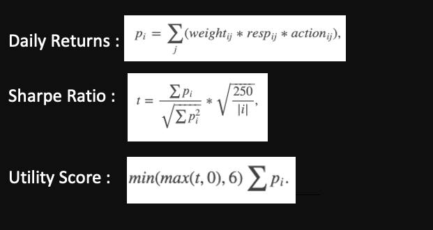

# JaneStreetMarketPrediction_Kaggle
I am participating in the Jane Street Market Prediction Kaggle challenge : https://www.kaggle.com/c/jane-street-market-prediction

## Data Description 
In this competiton we are given 500 days of historical stock market trading data and the objective is to build a quantitative trading model that maximises the utility. This is the trading data that is given, and each date is represented by numbers from 0 to 500, and each day has thousands of trades at different time stamps given by the ts_id.We also have a weight and return corresponding to each trade. Here resp is nothing but returns of the trade. We also have 130 features related to each trade but we donot know their meaning as their names are masked. 

And finally our aim is to predict the action, whch is to trade or not trade. 

## The returns of the portfolio is defined by this utility score given by Jane Street. 

## EDA 

. 

Firstly lets look at some EDA plots. So as the data is huge, I have looked at several things during my EDA, but keeping the time in mind, I will be mentioning only some of the interesting ones now. As we go ahead with the model development part, I will discuss more things in detail. 

In the first plot the blue line is the cumulative returns and the orange one is the cumulative weighted returns. The blue line shows that there is an upwards trend in returns 

But when we look at the cumulative weighted returns, its very stable till 300 days mark but falls steadily afterwards till 450 and is increasing again. From this we can see that weights play an important role in calculating the total utility. We will again revisist the importance of weights during the model development. 

The second diagram shows the feature correlations between the 130 features. The clusters formed here show that there some features which can be grouped together

## XG Boost Classifier model 
1) Classification Problem : Predict Action as (1 ,0)
2) Created Action column in the training data : 
	Action = 1 if return > 0 
	Action = 0 if return < 0 
	
- I first defined the problem to be a classification problem, where I will be using all the input data given to predict the action taken for each trade, as 0 or 1. Here 0 is that we donot take any action and 1 is that we take an action on the trade
So in the original data I added a column called Action which is 1 when returns is positive and zero otherwise. I did this because our daily return which is a product of weight return and action is positive only when return is positive. 

3) Trained the XGB Classifier 
4) Tuned the probability threshold based on the       Validation data 
	Action = 1 if Prob > Threshold 
	Action = 0 if Prob < Threshold 
  
- Using this I trained a simple XGB classifier model with inputs as all the 130 features and output as Action. 

This is the plot of the predicted probabilities of the action. 
After this I tuned the probability threshold based on the validation utility score such that when probability is more than threshold , the action is 1 and when probability is less than threshold, the action is 0 
After analysing the first model , I realized that the threshold that we are tuning plays an important role in getting a good utility score. 

Using this I got a threshold pf 0.527. I used this threshold on the test set to get a utility score of 1220.64 
So now this is my benchmark score. 

#### Score = 1220.64 for Th = 0.527

## Weights Distribution analysis 

After anlysing my model1 , I realized that the aroud 60% of the trades have weights less than 0.4 but these 60% trades only contribute to 3% of the utility score. This means that the utility score is extremely dependent on the high weighted trades. So, I decided to train the model only on those trades where the weights are high, because the low weight trades are anyways not going to change my model score. 

And this idea led to my second model 

 

 

## Returns Distribution analysis 

In order to further study the data and the model, I analyzed the return values. We can observe that the returns are highly concentrated around 0, and that more than 95% of the data lies in a very small interval around 0. 

Note that, we are defining this problem as a classification problem, by arbitrarily assigning action =1 when return > 0 in the training data. Since return could be noisy, this arbitrary classification based on return values leads to two classes with a lot of overlap. Performing classification on such highly overlapped classes is not an easy task.

Moreover, we see that the return values may be coming from different distributions, because the trades can correspond to different asset classes. Training a model on data with different distributions is not very fruitful. 

I take these trades which have a magnitude of return close to 0 and I model them together. Then I take the remaining trades and train a different model. 

## Results 
. 
I observed that the threshold values for all of these models are prettu robust around 0.52. 
This shows that the EDA and the corresponding analysis helped me to improve the models significantly. 

But one drawback in these models is the low precision scores. 

